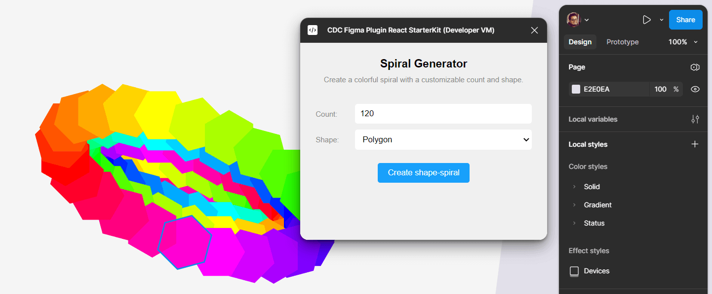

#### CDC Figma Plugin React Starterkit

A starter kit for building Figma plugins with React & TypeScript. Includes boilerplate code and essential config for quick Figma plugin development. 

Docs: [Getting started](https://github.com/codesign-cloud/cdc-figma-plugin-react-starterkit/blob/main/docs/readme.md)

