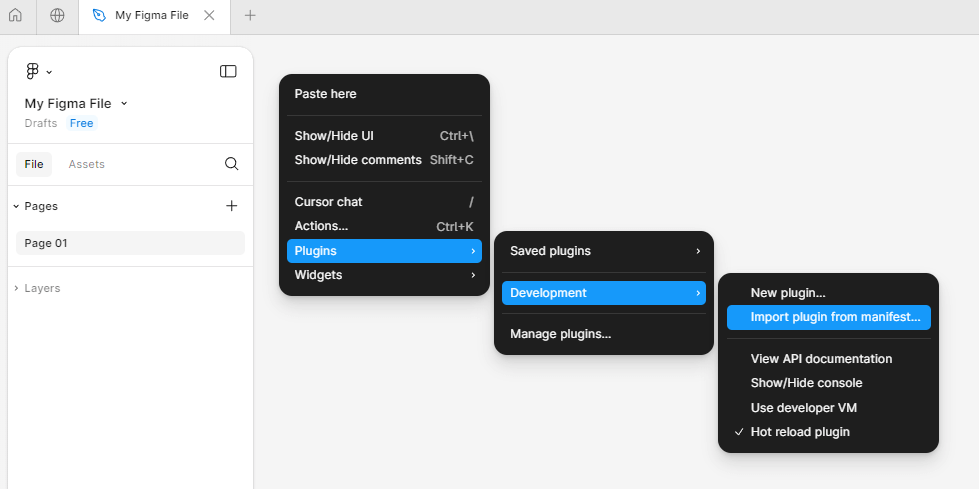
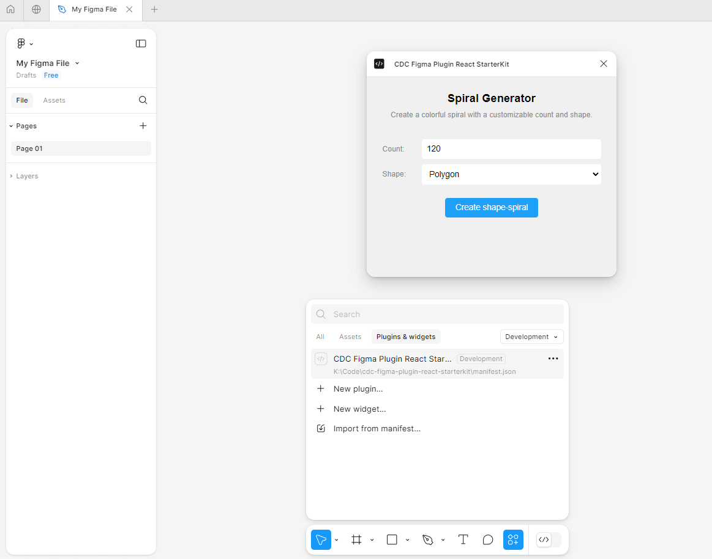
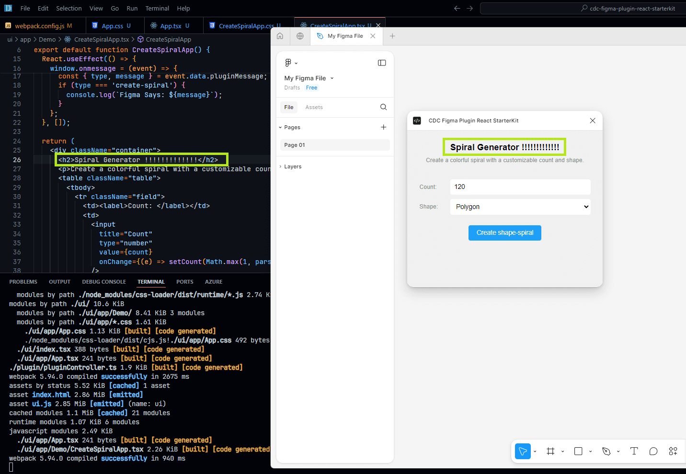
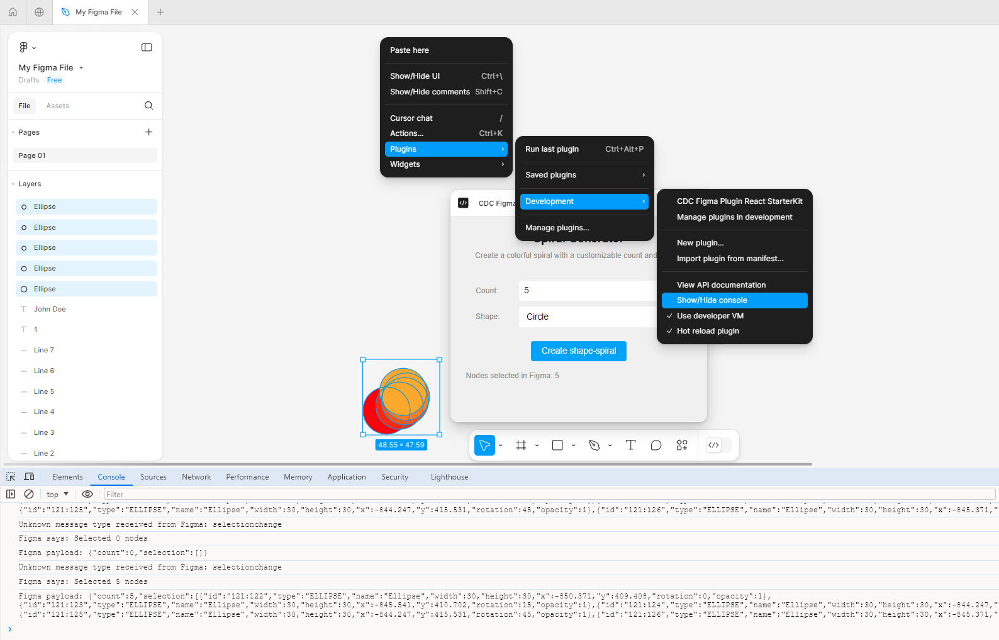

# CDC Figma Plugin React Starter Kit

 A starter kit for building Figma plugins with React & TypeScript. Includes boilerplate code and essential config for quick Figma plugin development.


 ### Getting Started

 1. Clone the repository
 2. Run `npm install`
 3. Run `npm run build:watch`
 4. Open the [Figma Desktop App](https://www.figma.com/downloads/), and [run the plugin](#running-the-plugin-locally)


 ##### Points to note

 1. Ensure that you have an **open Figma file** in the **Figma Desktop App** before attempting the manifest import, as it will only work within an active document context.
 2. The plugin uses a custom webpack build process. To make changes, you need to edit `webpack.config.js`

##### Running the plugin locally

<!-- tabs:start -->

#### **1: Import manifest**

Within the Figma desktop application, navigate to any file, right-click, and select Plugins > Development > "Import plugin from manifest..."



#### **2: Run Plugin**

To run the plugin by clicking on its name from the list. This will launch the plugin within the Figma environment, allowing you to interact with it as you would with a live plugin.



#### **3: Development**

Code updates are dynamically reflected through hot-reload



<!-- tabs:end -->

##### Debugging: Using the dev. console
 The development console in the Figma plugin environment (same as bringing up the dev console on Chrome) can come handy to log info during development. 

 To bring it up: Right click on an open file, goto Plugins, Development, and "Show/Hide console" to toggle it. 




##### Making HTTP requests


This project includes Axios to make HTTP calls from the React UI App. The pre-configured Axios client in `ui/app/utils/axiosClient.ts` allows users to make quick API calls with minimal setup. 

Remember to add any new domains you want to make requests to in the `manifest.json` file under `networkAccess.allowedDomains`.

`````js
import axiosClient from '../utils/axiosClient';
..
....
    const response = await axiosClient.get('https://zenquotes.io/api/random');
    const data = response.data;
`````


 ### Folder Structure

Figma plugins typically follow a specific structure to separate concerns and facilitate development. The main components are the UI (user interface) and the plugin controller, which interacts with the Figma API. The `manifest.json` file in the root directory defines the plugin's metadata, permissions, and entry points.

- The `/ui` directory contains the plugin's user interface (React app). This includes components, styles, and logic for the visual part of the plugin that users interact with. `/ui/app/hooks` and `/ui/app/utils` have reusable hooks and utility functions.

- The `/plugin` directory contains the Figma controller. This is where the core plugin logic resides, including interactions with the Figma API, document manipulation, and communication with the UI. The `/plugin/helpers` has resuable code.


### React Helpers

The `useFigmaMessaging` hook simplifies communication between your React app and Figma.

`````js
  const { sendToFigma, onFigmaMessage } = useFigmaMessaging({
    targetOrigin: 'https://www.figma.com', // * may be used for local testing, less secure
    debounceMs: 300, // debounce; to prevent spamming Figma with messages
  });
``````

````js
    // Example
    sendToFigma({ type: 'FETCH_DATA' });
    // Implement 'FETCH_DATA' handling in pluginController.ts > figma.ui.onmessage
    ..
    ...
    // Handling messages sent from the Plugin
    onFigmaMessage((msg) => {
        if (msg.type === 'FETCH_DATA_RESPONSE') {
            console.log('Received data from Figma:', msg.data);
        }
    });
````
This setup allows you to easily send messages to Figma and handle responses.