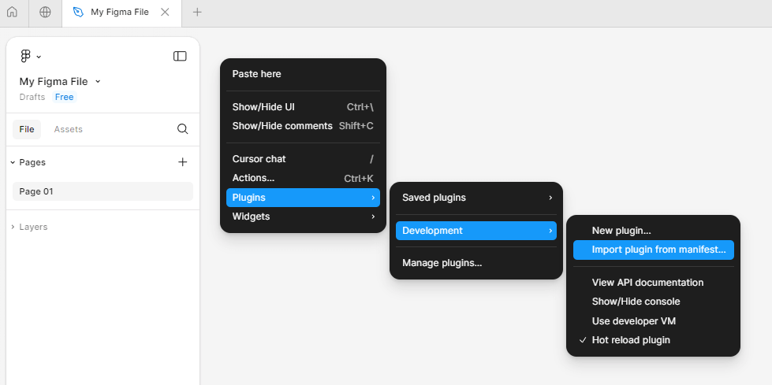
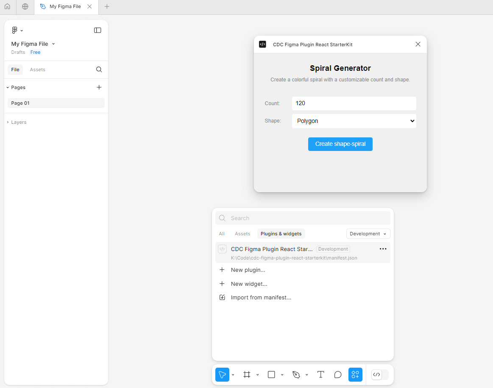
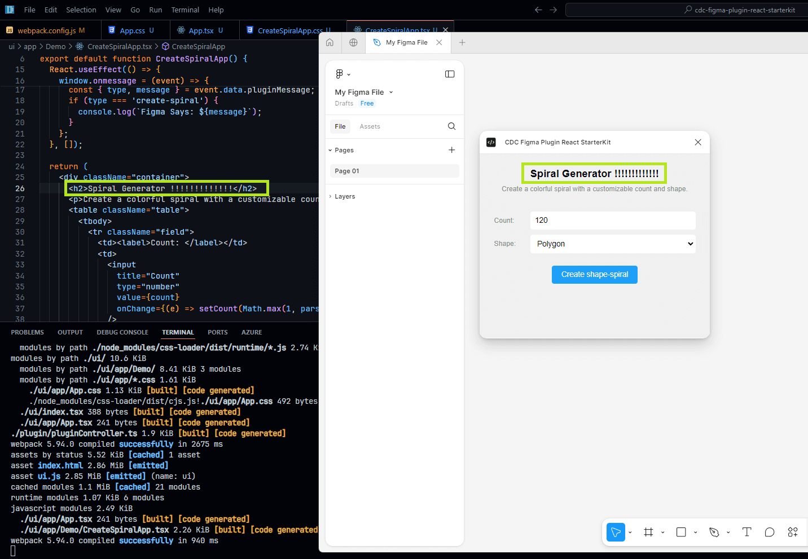
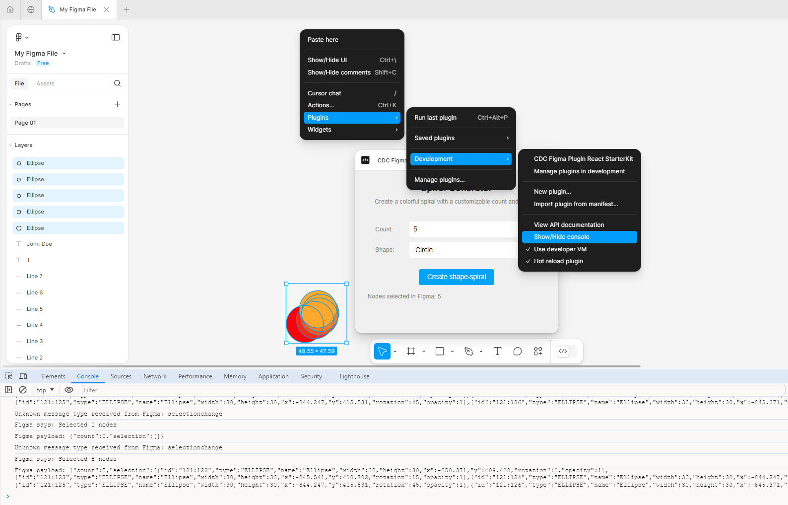

# CDC Figma Plugin React Starter Kit

 A starter kit for building Figma plugins with React & TypeScript. Includes boilerplate code and essential config for quick Figma plugin development. 

 ### Getting Started

 1. Clone the repository
 2. Run `npm install`
 3. Run `npm run build:watch`
 4. Open the [Figma Desktop App](https://www.figma.com/downloads/), and [run the plugin](#running-the-plugin-locally)

 ##### Points to note

 1. Ensure that you have an **open Figma file** in the **Figma Desktop App** before attempting the manifest import, as it will only work within an active document context.
 2. The plugin uses a custom webpack build process. To make changes, you need to edit `webpack.config.js`

##### Running the plugin locally

<!-- tabs:start -->

#### **1: Import manifest**

Within the Figma desktop application, navigate to any file, right-click, and select Plugins > Development > "Import plugin from manifest..."

#### **2: Run Plugin**

To run the plugin by clicking on its name from the list. This will launch the plugin within the Figma environment, allowing you to interact with it as you would with a live plugin.

#### **3: Development**

Code updates are dynamically reflected through hot-reload

<!-- tabs:end -->

##### Debugging: Using the dev. console
 The development console in the Figma plugin environment (same as bringing up the dev console on Chrome) can come handy to log info during development. 

 To bring it up: Right click on an open file, goto Plugins, Development, and "Show/Hide console" to toggle it. 

 ## Folder Structure

- The `/ui` directory contains the React code for the plugin's user interface.
- The `/plugin` directory contains the Figma controller
